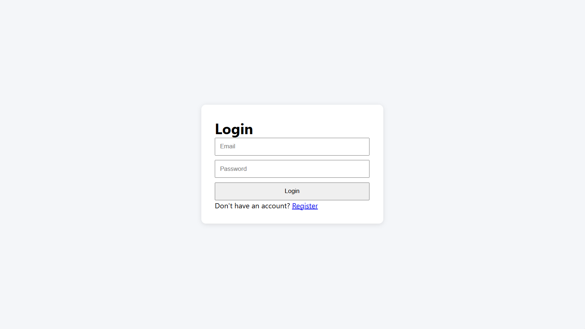
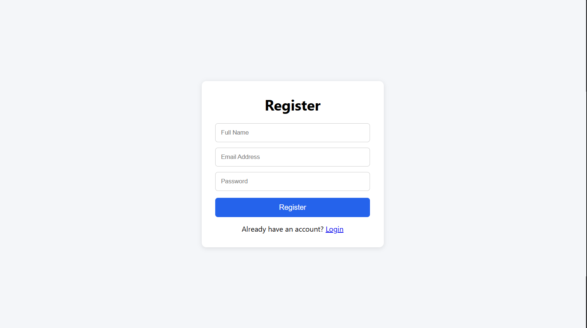
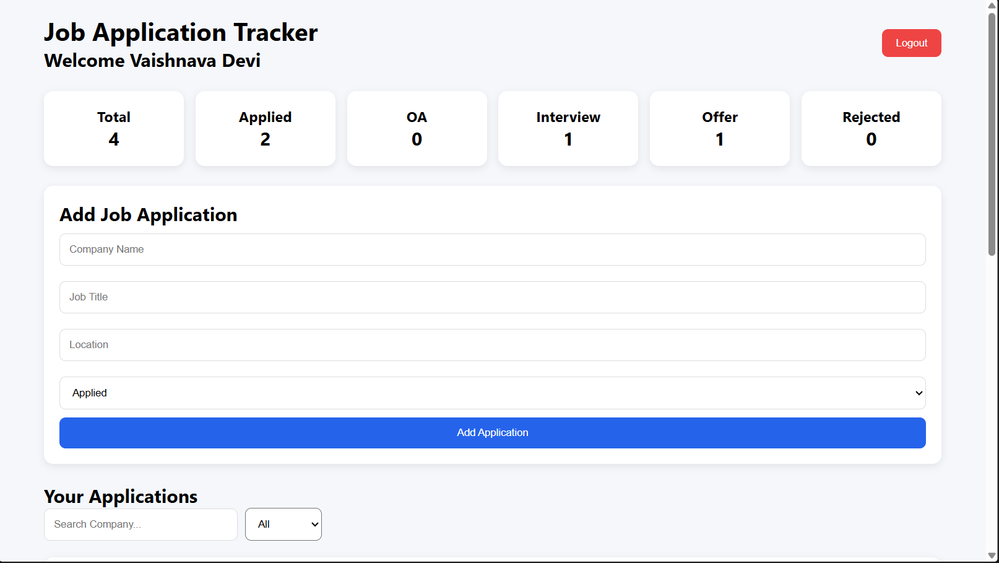
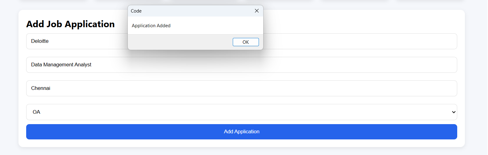
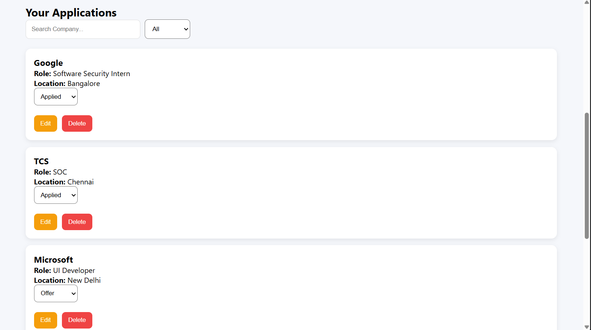
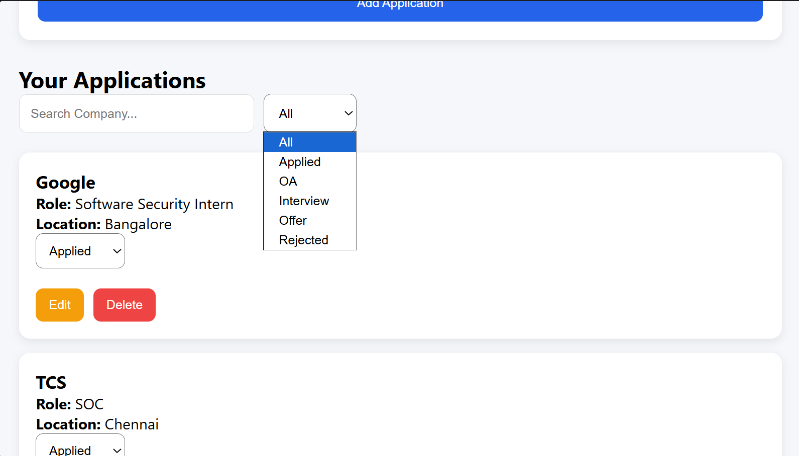

# 🚀 Job Application Tracker Portal

A modern Full-Stack MERN (MongoDB, Express.js, React.js, Node.js) application designed to help students, job seekers, and professionals efficiently track, manage, and organize their job applications in one centralized dashboard.

---

# 📌 Overview

Applying to multiple internships and jobs can quickly become difficult to manage. This application provides a complete solution for tracking applications, monitoring progress, managing statuses, and organizing opportunities throughout the placement journey.

Built using the MERN Stack, this project demonstrates full-stack development concepts including authentication, protected routes, CRUD operations, REST APIs, database management, frontend-backend integration, search functionality, filtering, and dashboard analytics.

---

# ✨ Features

## 🔐 Authentication & Security

- User Registration
- User Login
- JWT Authentication
- Password Encryption using bcryptjs
- Protected Routes
- Secure User Sessions
- Logout Functionality

---

## 📋 Job Application Management

- Add New Applications
- View All Applications
- Edit Existing Applications
- Delete Applications
- Delete Confirmation Dialog
- Update Application Status
- Real-Time Dashboard Updates

---

## 🔍 Search & Filter

- Search Applications by Company Name
- Filter Applications by Status
- Dynamic Search Results
- Instant Filtering

### Supported Status Types

- Applied
- OA (Online Assessment)
- Interview
- Offer
- Rejected

---

## 📊 Dashboard Analytics

Track your placement progress with:

- Total Applications
- Applied Count
- OA Count
- Interview Count
- Offer Count
- Rejected Count

---

## 🎨 User Experience

- Modern Dashboard Interface
- Responsive Layout
- Professional Card-Based Design
- Loading State
- Empty State UI
- Interactive Status Updates
- Clean Navigation Flow

---

# 🛠️ Tech Stack

## Frontend

- React.js
- React Router DOM
- Axios
- CSS3

## Backend

- Node.js
- Express.js

## Database

- MongoDB
- Mongoose

## Authentication

- JWT (JSON Web Token)
- bcryptjs

## Development Tools

- VS Code
- Git
- GitHub
- Thunder Client
- MongoDB Compass

---

# 📂 Project Structure

```bash
Job-Application-Tracker-Portal
│
├── client
│   ├── src
│   │
│   ├── components
│   │   └── ProtectedRoute.jsx
│   │
│   ├── context
│   │
│   ├── pages
│   │   ├── Login.jsx
│   │   ├── Register.jsx
│   │   └── Dashboard.jsx
│   │
│   ├── services
│   │   ├── authService.js
│   │   └── jobService.js
│   │
│   ├── styles
│   │   └── dashboard.css
│   │
│   ├── App.jsx
│   └── main.jsx
│
├── server
│   ├── config
│   │   └── db.js
│   │
│   ├── controllers
│   │   ├── authController.js
│   │   └── jobController.js
│   │
│   ├── middleware
│   │   ├── authMiddleware.js
│   │   └── errorMiddleware.js
│   │
│   ├── models
│   │   ├── User.js
│   │   └── Job.js
│   │
│   ├── routes
│   │   ├── authRoutes.js
│   │   └── jobRoutes.js
│   │
│   ├── .env
│   ├── server.js
│   └── package.json
│
├── images
│
└── README.md
```

---

# ⚙️ Installation & Setup

## 1️⃣ Clone Repository

```bash
git clone https://github.com/VaishnavaDevi-R/Job-Application-Tracker-Portal.git
```

```bash
cd Job-Application-Tracker-Portal
```

---

## 2️⃣ Backend Setup

Navigate to server:

```bash
cd server
```

Install dependencies:

```bash
npm install
```

Create a `.env` file:

```env
PORT=5000
MONGO_URI=your_mongodb_connection_string
JWT_SECRET=your_secret_key
```

Start backend:

```bash
npm run server
```

---

## 3️⃣ Frontend Setup

Navigate to client:

```bash
cd client
```

Install dependencies:

```bash
npm install
```

Run frontend:

```bash
npm run dev
```

---

# 🌐 API Endpoints

## Authentication Routes

| Method | Endpoint | Description |
|----------|----------|----------|
| POST | `/api/auth/register` | Register User |
| POST | `/api/auth/login` | Login User |

---

## Job Routes

| Method | Endpoint | Description |
|----------|----------|----------|
| GET | `/api/jobs` | Get All Applications |
| POST | `/api/jobs` | Create Application |
| PUT | `/api/jobs/:id` | Update Application |
| DELETE | `/api/jobs/:id` | Delete Application |

---

# 📈 Application Workflow

```text
Applied
   ↓
OA
   ↓
Interview
   ↓
Offer
```

Alternative Flow:

```text
Applied
   ↓
Rejected
```

---

# 📸 Screenshots

## 🔑 Login Page



---

## 📝 Register Page



---

## 📊 Dashboard



---

## ➕ Add Application



---

## 📋 Applications List



---

## 🔍 Search & Filter



---

# 🚀 Future Enhancements

- Dark Mode
- Resume Upload Feature
- Interview Scheduler
- Email Notifications
- Application Deadlines
- Charts & Analytics
- Notes Section
- Export Data to PDF/Excel
- MongoDB Atlas Integration
- Cloud Deployment

---

# 🎯 Learning Outcomes

This project helped strengthen practical skills in:

- MERN Stack Development
- REST API Development
- Authentication & Authorization
- CRUD Operations
- MongoDB Database Design
- React State Management
- Protected Routes
- API Integration
- Frontend & Backend Communication
- Git & GitHub Workflow
- Full-Stack Project Architecture

---

# 👩‍💻 Author

**Vaishnava Devi**

---

# ⭐ Support

If you found this project useful:

⭐ Star the Repository

🍴 Fork the Project

📢 Share Feedback

🚀 Connect and Collaborate

---

# 📜 License

This project is developed for educational, portfolio, and learning purposes.

---

## 🔥 Project Highlights

✔ Full-Stack MERN Application  
✔ JWT Authentication  
✔ Protected Routes  
✔ Complete CRUD Operations  
✔ Search & Filtering  
✔ Dashboard Analytics  
✔ Modern UI Design  
✔ MongoDB Integration  
✔ Portfolio Ready  
✔ Internship & Placement Ready  

Built to simplify and streamline the job application tracking process while strengthening practical full-stack development skills. 🚀✨